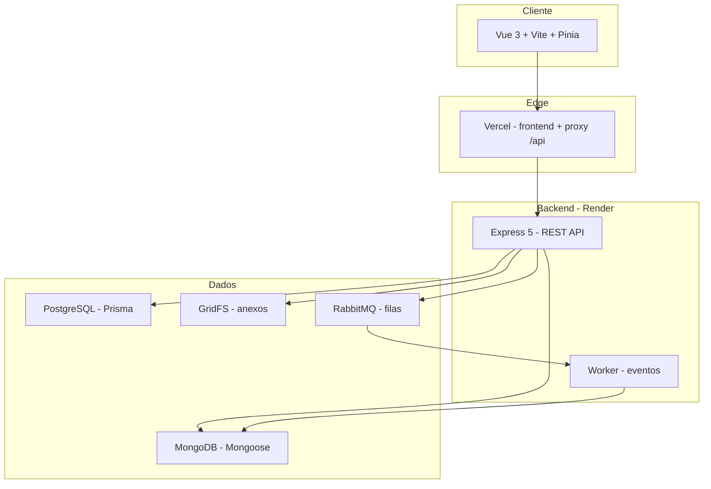

<div align="center">


# Assetra

**Gestão corporativa de ativos de tecnologia**

Plataforma web multi-tenant para inventário, movimentações, manutenções e fluxos de aprovação, com papéis, notificações e integrações.

<br />

[](https://vuejs.org/)
[](https://www.typescriptlang.org/)
[](https://nodejs.org/)
[](https://expressjs.com/)
[](https://www.prisma.io/)
[](https://www.mongodb.com/)

<br />

[Visão geral](#visão-geral) ·
[Funcionalidades](#funcionalidades) ·
[Arquitetura](#arquitetura) ·
[Início rápido](#início-rápido) ·
[Deploy](#deploy) ·
[Documentação](#documentação) ·
[FAQ](FAQ.md)

</div>

---

## Visão geral

O **Assetra** centraliza o ciclo de vida dos ativos de TI de uma organização: cadastro, responsáveis, transferências entre utilizadores, ordens de serviço de manutenção e decisões formais por gestores e administradores.

| | |
|---|---|
| **Público-alvo** | Empresas e equipas de TI que precisam de rastreabilidade e governança |
| **Modelo** | Multi-tenant (cada organização com dados isolados) |
| **Interface** | Dashboard responsivo, tema claro/escuro |
| **Segurança** | JWT em cookie `httpOnly`, RBAC por perfil, confirmação de ações sensíveis |

---

## Funcionalidades

<table>
<tr>
<td width="50%" valign="top">

### Inventário

- Cadastro de ativos com tag, descrição e anexos
- Estados: em uso, disponível, em manutenção
- Atribuição por utilizador (e-mail corporativo)
- Vista **Meus ativos** para funcionários e técnicos

### Movimentações

- Transferência de responsabilidade entre utilizadores
- Fluxo com **aprovação** do gestor
- Histórico auditável

</td>
<td width="50%" valign="top">

### Manutenções

- Abertura de ordem de serviço (OS) com severidade
- Fila de **execução técnica** e prazos
- Validação de conclusão pelo gestor
- Pedidos de adiamento de prazo

### Governança

- Painel de **aprovações** (abertura, validação, movimentação)
- **Solicitações** com wizard e anexos
- Utilizadores, convites por e-mail e login Google
- API de **integrações** (ADM) e relatórios exportáveis

</td>
</tr>
</table>

### Perfis de acesso

| Perfil | Principais capacidades |
|--------|------------------------|
| **Administrador** | Configuração global, integrações, decisões de alto nível |
| **Gestor** | Aprovações, movimentações, manutenções, utilizadores, relatórios |
| **Técnico** | Execução de OS, solicitações, ativos atribuídos |
| **Funcionário** | Consulta e solicitações sobre ativos próprios |

---

## Arquitetura



<details>
<summary><strong>Stack técnica (detalhe)</strong></summary>

<br />

| Camada | Tecnologias |
|--------|-------------|
| **Frontend** | Vue 3, TypeScript, Vue Router, Pinia, Axios, Lucide Icons, Vite |
| **Backend** | Node.js, Express 5, Zod, Multer, JWT, Helmet, CORS |
| **Relacional** | Prisma, PostgreSQL (ou SQLite em dev) |
| **Documentos** | Mongoose, MongoDB Atlas |
| **Mensageria** | RabbitMQ (CloudAMQP) + worker de notificações |
| **E-mail** | Brevo / Resend / SMTP (dev) |
| **Auth** | Senha + Google OAuth |
| **Deploy** | Vercel (SPA) + Render (API + worker) |

</details>

---

## Início rápido

### Pré-requisitos

- **Node.js** 20+
- **npm** 10+
- **MongoDB** (local ou Atlas)
- **PostgreSQL** ou SQLite (dev via `file:./dev.db`)
- **RabbitMQ** (opcional em dev; necessário para e-mails assíncronos)

### 1. Clonar e instalar

```bash
git clone https://github.com/SUA-ORG/assetra-app.git
cd assetra-app
npm install
npm run setup:backend
```

### 2. Configurar o backend

```bash
cp backend/.env.example backend/.env
# Edite JWT_SECRET, MONGODB_URL, DATABASE_URL, CORS_ORIGIN, etc.
```

### 3. Base de dados

```bash
npm run db:push
npm run db:generate
# Opcional: dados de demonstração
npm run db:seed
```

### 4. Subir em desenvolvimento

```bash
npm run dev
```

| Serviço | URL |
|---------|-----|
| Frontend | http://localhost:5173 |
| API | http://localhost:3000/api |
| Health | http://localhost:3000/api/health |

---

## Deploy

Produção recomendada: **Vercel** (frontend) + **Render** (backend e worker), com blueprint em `render.yaml`.

```text
Frontend  ->  https://seu-projeto.vercel.app
Backend   ->  https://seu-backend.onrender.com
```

Guia completo: [docs/deploy-vercel-render.md](docs/deploy-vercel-render.md)

<details>
<summary><strong>Variáveis essenciais (produção)</strong></summary>

<br />

**Render (backend + worker)**

- `JWT_SECRET`, `MONGODB_URL`, `DATABASE_URL`
- `CORS_ORIGIN`, `FRONTEND_URL`, `API_PUBLIC_URL`
- `BREVO_API_KEY` ou `RESEND_API_KEY`, `EMAIL_FROM`
- `RABBITMQ_URL`, `EVENT_BROKER_DRIVER=rabbitmq`

**Vercel (frontend)**

- `VITE_API_BASE_URL=/api`
- `VITE_API_UPLOAD_BASE_URL=https://SEU-BACKEND.onrender.com/api`
- `VITE_GOOGLE_CLIENT_ID`

</details>

---

## Estrutura do repositório

```text
assetra-app/
|-- public/              # Logotipo e assets estáticos
|-- src/                 # Frontend Vue + TypeScript
|   |-- components/
|   |-- views/
|   |-- stores/
|   +-- router/
|-- backend/
|   |-- src/
|   |   |-- routes/
|   |   |-- services/
|   |   |-- models/
|   |   +-- workers/
|   |-- prisma/
|   +-- scripts/
|-- docs/                # Manuais, deploy, integrações
|-- render.yaml          # Blueprint Render
+-- vercel.json          # Proxy /api para o backend
```

---

## Documentação

| Documento | Conteúdo |
|-----------|----------|
| [Deploy Vercel + Render](docs/deploy-vercel-render.md) | Produção, CORS, anexos, e-mail |
| [Google Login](docs/configurar-google-login.md) | OAuth no Google Cloud |
| [Brevo](docs/configurar-brevo.md) | E-mail transacional (Render free) |
| [Resend](docs/configurar-resend.md) | Alternativa de e-mail |
| [Padrões de arquitetura](docs/architecture-patterns.md) | Services, event bus, clean code |
| [FAQ](FAQ.md) | Perguntas frequentes (TCC, utilizadores, deploy) |

---

## Identidade visual

| Token | Hex | Uso |
|-------|-----|-----|
| **Primary** | `#3b82f6` | Botões, links, destaques |
| **Fundo (tema claro)** | `#f8fafc` | Área principal |
| **Cartões** | `#ffffff` | Cards e painéis |
| **Hover** | `#f1f5f9` | Estados interativos |
| **Texto secundário** | `#475569` | Legendas e metadados |

---

## Scripts úteis

```bash
npm run dev              # Frontend + backend em paralelo
npm run build            # Build de produção (Vite)
npm run db:push          # Sincronizar schema Prisma
npm run uploads:migrate-gridfs   # Migrar anexos locais para MongoDB (backend)
```

---

## Contribuição

1. Crie uma branch a partir de `main`: `feat/nome-da-funcionalidade`
2. Siga os padrões existentes em `backend/src/services` e componentes Vue
3. Não commite `.env`, chaves API nem `backend/uploads/` com dados reais
4. Abra um Pull Request com descrição clara e passos de teste

---

<div align="center">

**Assetra** - controle, rastreabilidade e governança para o seu parque de ativos.

<br />

<sub>Projeto acadêmico / corporativo - AESA</sub>

<br />

[](docs/deploy-vercel-render.md)

</div>
