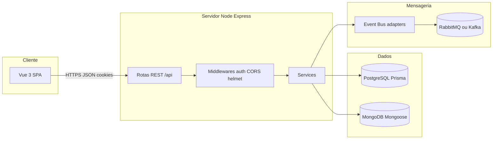

# 5 Documentação técnica — Assetra

Este documento descreve a arquitetura, tecnologias, padrões, boas práticas, infraestrutura, APIs e organização do repositório do **Assetra**, alinhado ao roteiro académico da disciplina.

**Citação ao Diagrama de Arquitetura:** no trabalho escrito ou apresentação, deve referir-se ao **Diagrama de Arquitetura** já discutido no âmbito do projeto (por exemplo no **DEM** ou documento de modelagem), como ilustração visual da macroestrutura aqui descrita em texto. O diagrama oficial complementa os fluxos abaixo (cliente → API → bases de dados → mensageria).

**Link do repositório (substituir pelo URL real):**  
`https://github.com/SEU_USUARIO/assetra-app` — ou o URL do GitLab/Bitbucket utilizado pela equipa.

---

## 5.1 Arquitetura do sistema

### Macroestrutura

O Assetra é uma **aplicação web cliente-servidor**:

- **Cliente:** SPA (Single Page Application) em **Vue 3**, executada no navegador, que consome a API via **HTTPS** em produção ou via **proxy** em desenvolvimento (`VITE_API_BASE_URL` / `/api`).
- **Servidor:** **monólito modular em camadas** implementado em **Node.js** com **Express 5** — um único processo expõe todos os endpoints REST (`/api/...`). Não há decomposição em microserviços independentes; a modularização é feita por **routers**, **middlewares**, **services** e **models**.
- **Dados poliglotes:**
  - **PostgreSQL** (via **Prisma**): identidade, multitenancy (`Tenant`, `User`), credenciais e perfis.
  - **MongoDB** (via **Mongoose**): domínio operacional (ativos, manutenções, movimentações, aprovações, auditoria em documentos).
- **Mensageria assíncrona:** publicação de eventos de domínio através de **RabbitMQ** ou **Kafka** (configurável por `EVENT_BROKER_DRIVER`), com **circuit breaker** e worker opcional para consumo.
- **Deploy típico:** frontend na **Vercel**, backend e worker no **Render** (ver `render.yaml` e `docs/deploy-vercel-render.md`).

**Modelo escolhido:** **arquitetura monolítica em camadas** com separação lógica entre apresentação HTTP, regras de negócio (services), persistência (Prisma/Mongoose) e integrações (brokers, API de integração externa). Esta escolha simplifica o deploy académico e mantém coerência transacional no mesmo processo Node.



### 5.1.1 Segmentação da arquitetura

A divisão lógica inspira-se em **camadas** semelhantes às de **DDD / Clean Architecture** de forma **pragmática** (não há camada de domínio pura isolada de frameworks em todos os módulos, mas há separação clara de responsabilidades).

| Camada lógica | Localização no código | Função |
|----------------|------------------------|--------|
| **Apresentação (HTTP)** | `backend/src/routes/*.js` | Define verbos HTTP, monta respostas JSON, delega validação e serviços. |
| **Aplicação / orquestração** | Rotas + `asyncHandler` + middlewares | Encadeia autenticação (`authMiddleware`), autorização (`authorize`), limites de taxa e chamadas aos services. |
| **Domínio / negócio** | `backend/src/services/*.js` | Regras de negócio (ex.: aprovações, manutenções, relatórios), uso de `AppError` para falhas de domínio. |
| **Infraestrutura** | `backend/src/lib/prisma.js`, `mongoose.js`, `backend/src/models/*`, `backend/src/adapters/*` | Conexões, persistência, adaptadores para brokers (RabbitMQ/Kafka). |
| **Cliente (UI)** | `src/` | Views Vue, router, stores Pinia, serviço Axios. |

**Como as camadas comunicam:** as rotas recebem `req`/`res`, leem `req.user` (JWT após `authMiddleware`) e invocam funções exportadas dos **services** com `tenantId` e identificador do ator. Os services consultam **Prisma** ou **Mongoose** e devolvem objetos já adequados à API (DTOs). Eventos secundários (auditoria, fila) são disparados a partir dos services sem acoplar a UI.

---

## 5.2 Tecnologias utilizadas

### 5.2.1 Frontend

| Tecnologia | Versão (referência `package.json`) | Uso |
|------------|--------------------------------------|-----|
| **Vue** | `^3.5.32` | Framework UI (Composition API, `<script setup>`). |
| **Vue Router** | `^5.0.4` | Rotas SPA, guards de autenticação e perfis (`meta.roles`). |
| **Pinia** | `^3.0.4` | Estado global (`auth`, `inventory`) e chamadas à API. |
| **Axios** | `^1.14.0` | Cliente HTTP com `withCredentials: true` (cookies de sessão). |
| **TypeScript** | `~6.0.2` (devDependency) | Tipagem em `src/**/*.ts` e suporte no build. |
| **Vite** | `^8.0.4` | Dev server e build do frontend. |
| **@vitejs/plugin-vue** | `^6.0.5` | Integração Vue + Vite. |
| **lucide-vue-next** | `^0.468.0` | Ícones. |
| **CSS** | — | Estilos em `src/styles.css` e `<style scoped>` nos componentes (sem Tailwind no manifesto de dependências). |

### 5.2.2 Backend

| Tecnologia | Versão | Uso |
|------------|--------|-----|
| **Node.js** | Runtime (recomendado: **18 LTS** ou superior) | Execução do servidor e dos testes. |
| **Express** | `^5.2.1` | Aplicação HTTP, routers, middlewares. |
| **dotenv** | `^17.4.1` | Carregamento de variáveis de ambiente. |
| **jsonwebtoken** | `^9.0.3` | JWT de sessão. |
| **bcryptjs** | `^3.0.3` | Hash de palavras-passe (Prisma). |
| **cookie-parser** | `^1.4.7` | Leitura do cookie `token`. |
| **cors** | `^2.8.6` | Origens permitidas (`CORS_ORIGIN`). |
| **helmet** | `^8.1.0` | Cabeçalhos de segurança HTTP. |
| **express-rate-limit** | `^8.3.2` | Limite de pedidos (login, integrações). |
| **zod** | `^4.3.6` | Validação de esquemas de entrada. |
| **multer** | `^2.1.1` | Upload de ficheiros. |
| **google-auth-library** | `^10.6.2` | Validação de credenciais Google no login. |
| **amqplib** / **kafkajs** | `^1.0.7` / `^2.2.4` | Adaptadores do event bus. |

### 5.2.3 Banco de dados

| SGBD | Papel | ORM / ODM |
|------|--------|-----------|
| **PostgreSQL** | Tenants, utilizadores, roles, credenciais. | **Prisma** `@prisma/client` e CLI `5.22.0` — `backend/prisma/schema.prisma`. |
| **MongoDB** | Ativos, manutenções, movimentações, aprovações, logs de auditoria. | **Mongoose** `^9.4.1` — `backend/src/models/`. |

Variáveis típicas: `DATABASE_URL`, `MONGODB_URL`.

### 5.2.4 Ferramentas de apoio

| Ferramenta | Função |
|-------------|--------|
| **Git** | Versionamento do código. |
| **npm** | Gestão de dependências e scripts (`npm run dev`, `npm test`). |
| **concurrently** (`^9.2.1`) | Arranque simultâneo frontend + backend na raiz do projeto. |
| **Docker / Docker Compose** | `backend/docker-compose.yml` — serviços auxiliares (ex.: PostgreSQL, RabbitMQ) em ambiente local, quando disponível. |
| **Render / Vercel** | Hospedagem de backend/worker e frontend (ficheiros `render.yaml`, `vercel.json`). |
| **Postman / Insomnia / Thunder Client** | Testes manuais de REST (`/api/health`, auth, CRUD). |
| **Cursor / VS Code** | IDE e eventualmente assistência por IA na escrita de código e documentação. |

### 5.2.5 Padrões adotados (design patterns)

| Padrão | Onde e para quê |
|--------|-----------------|
| **Middleware em cadeia** | Express: `helmet`, `cors`, `json`, `cookieParser`, depois `app.use('/api/...', router)`. |
| **Adapter** | `backend/src/adapters/eventBus/rabbitMqAdapter.js` e `kafkaAdapter.js` — isolam detalhes de cada broker; `eventBus.js` orquestra e escolhe o driver. |
| **Circuit Breaker** | `backend/src/utils/circuitBreaker.js` — protege chamadas ao broker contra cascata de falhas. |
| **Singleton (Prisma Client)** | `backend/src/lib/prisma.js` — uma instância reutilizada. |
| **Repository implícito** | Prisma e Mongoose como camada de acesso; serviços chamam modelos/APIs ORM em vez de SQL embutido nas rotas. |
| **Factory / HOF** | `authorize(['ADM','GESTOR'])` em `middlewares/auth.js` — função que devolve middleware configurado. |
| **DTO via validação** | Funções `toDto` nos services (ex.: `maintenanceService.js`, `approvalService.js`) mapeiam documentos Mongo para objetos JSON estáveis. |

### 5.2.6 Boas práticas e convenções

#### SOLID (exemplos no projeto)

- **SRP (Single Responsibility):** ficheiros de rotas por recurso (`assets.js`, `maintenances.js`); middlewares dedicados a autenticação/autorização; serviços com nomes alinhados ao caso de uso (`approvalService`, `reportService`).
- **OCP (Open/Closed):** novos endpoints podem ser acrescentados com novos routers em `routes/` e registo em `server.js` sem alterar o núcleo de outros módulos.
- **DIP (Dependency Inversion) — exemplo com adaptadores:** o domínio publica eventos através de `publishDomainEvent` / `publishDomainEventSafely` sem importar diretamente `amqplib` ou `kafkajs` nos services de negócio principal; a infraestrutura concreta está nos **adapters** do event bus, reduzindo acoplamento.

#### Clean Code

- Nomes descritivos (`listMaintenancesForTenant`, `integrationApiKeyAuth`, `publishDomainEventSafely`).
- Funções com propósito único nos utils (`asyncHandler`, `AppError`).
- Evitar comentários óbvios; preferir código legível e mensagens de erro úteis ao utilizador (`message` em JSON).

#### DTOs (Data Transfer Objects)

- Os services expõem objetos **planos** (campos necessários para a API) via funções `toDto` ou agregações em `reportService.js`, em vez de devolver documentos Mongoose crus com metadados internos.
- **Zod** valida o corpo de entrada (`safeParse`) antes de persistir — atua como contrato/DTO de entrada nas rotas que o utilizam.

#### Tratamento de erros e exceções

- **`AppError`:** erros operacionais com `statusCode` e mensagem.
- **`asyncHandler`:** captura promessas rejeitadas nas rotas async.
- **Handler global** em `server.js`: distingue `AppError`, erros de upload/Prisma e devolve JSON genérico em produção (`Erro interno do servidor.`) sem expor stack trace ao cliente.

#### Versionamento semântico e Git

- `package.json` raiz: `version` `0.0.0` (protótipo); backend: `1.0.0`.
- **Recomendação:** usar tags `v1.0.0`, `v1.1.0` em marcos de entrega; commits com mensagens claras (ex.: convenção *Conventional Commits*: `feat:`, `fix:`, `docs:`).

#### Padrão de resposta da API

- **Não** existe um envelope único `{ data, error, message }` em todos os endpoints.
- **Prática atual:** em sucesso, muitas rotas devolvem o recurso ou lista **diretamente** em JSON; em erro, `{ message: '...' }` (e por vezes `issues` com detalhes Zod).
- Rotas de integração e relatórios podem incluir metadados (`version`, `protocol`, `data`) — ver `integrations.js` e respostas de `/api/reports/export/:type`.

#### Injeção de dependência

- **Manual:** `import` de módulos (`prisma`, modelos Mongoose). Não há container IoC (tipo NestJS).

#### Mapeamento de objetos

- Conversão **manual** nos services (`toDto`, agregações em `reportService.js`).

#### Segurança básica

- Segredos e URLs em **variáveis de ambiente** (`backend/.env`, nunca commitar produção — ver `.gitignore`).
- **bcrypt** para hash de palavras-passe.
- **JWT** em cookie **httpOnly**; CORS restrito; rate limit em login e integrações; validação de uploads por tenant em `uploads.js`.
- **INTEGRATION_API_KEYS** ou par **INTEGRATION_API_KEY** + **INTEGRATION_TENANT_ID** para API de parceiros.

---

## 5.2.7 Requisitos de infraestrutura

### Ambiente de desenvolvimento

- **SO:** Windows 10/11, Linux ou macOS.
- **Node.js:** 18.x ou superior (recomendado LTS).
- **npm:** compatível com o lockfile do projeto.
- **Memória RAM:** mínimo **4 GB** (8 GB recomendado com IDE + browser + Mongo + Postgres locais).
- **Disco:** espaço para `node_modules` e bases locais.
- **Serviços:** instâncias acessíveis de **PostgreSQL**, **MongoDB** e, opcionalmente, **RabbitMQ** (ou URL CloudAMQP em `.env`).

### Produção

- Seguir limites do plano **Render** (free tier) e **Vercel**; configurar todas as variáveis listadas em `backend/.env.example` e `docs/deploy-vercel-render.md`.

---

## 5.2.8 APIs e integrações externas

| Serviço | Uso no Assetra |
|---------|----------------|
| **Google Identity / OAuth** | Login e pré-preenchimento de dados no admin: `google-auth-library` no backend; no frontend, `VITE_GOOGLE_CLIENT_ID` e script GIS quando aplicável. |
| **RabbitMQ (ex.: CloudAMQP)** | Broker AMQP para eventos de domínio; variável `RABBITMQ_URL`; worker `npm run worker:events`. |
| **Kafka (opcional)** | Alternativa configurável por `EVENT_BROKER_DRIVER=kafka` e `KAFKA_BROKERS`. |
| **Render** | Hospedagem do API Node e do worker; health check em `/api/health`. |
| **Vercel** | Hospedagem do build estático Vue. |

A **API de integração** (`/api/integrations`, autenticação por `X-API-Key`) expõe operações para sistemas parceiros (ex.: listagem de manutenções, reatribuição, auditoria por entidade).

---

## 5.2.9 Caracterização da API

- **Estilo:** **REST** sobre **HTTP/1.1** (e HTTPS em produção).
- **Formato de troca:** **JSON** (`Content-Type: application/json`), exceto uploads (`multipart/form-data`) e ficheiros servidos por `GET /api/uploads/:filename`.
- **Autenticação principal:** cookie **httpOnly** com JWT; o cliente Axios envia `withCredentials: true`. Pode coexistir header `Authorization: Bearer` em cenários legados, mas a sessão privilegia cookie.
- **Endpoints de exemplo:** `/api/auth/*`, `/api/assets`, `/api/maintenances`, `/api/movements`, `/api/approvals`, `/api/tasks`, `/api/uploads`, `/api/users`, `/api/reports/summary`, `/api/reports/export/:type`, `/api/integrations/v1/*`, `/api/health`, `/api/metrics`.

---

## 5.3 Repositório e código-fonte

### 5.3.1 Localização

O código reside no repositório Git indicado na secção inicial (substituir placeholder pelo URL real do GitHub/GitLab).

### 5.3.2 Estrutura de pastas (árvore simplificada)

```text
assetra-app/
├── backend/
│   ├── prisma/
│   │   └── schema.prisma
│   ├── scripts/
│   ├── src/
│   │   ├── adapters/          # Adaptadores (ex.: event bus Rabbit/Kafka)
│   │   ├── lib/               # Prisma, Mongoose, eventBus
│   │   ├── middlewares/     # auth, integração, testes unitários middleware
│   │   ├── models/            # Schemas Mongoose
│   │   ├── routes/            # Routers Express por recurso
│   │   ├── services/          # Regras de negócio e relatórios
│   │   ├── utils/             # AppError, asyncHandler, circuitBreaker
│   │   ├── workers/           # Consumidor de eventos
│   │   └── server.js          # Entrada HTTP
│   ├── docker-compose.yml
│   ├── package.json
│   └── seed.js
├── docs/                      # Documentação (deploy, arquitetura, este ficheiro)
├── public/
├── src/                       # Frontend Vue
│   ├── components/
│   ├── composables/
│   ├── router/
│   ├── services/              # Cliente Axios
│   ├── stores/
│   ├── types/
│   ├── utils/
│   ├── views/
│   ├── App.vue
│   └── main.ts
├── index.html
├── package.json
├── vite.config.ts
├── vercel.json
└── render.yaml
```

### 5.3.3 Conteúdo das pastas principais

| Pasta | Conteúdo |
|-------|----------|
| **`src/`** | Interface Vue: páginas, componentes, estado Pinia, router, chamadas HTTP. |
| **`backend/src/routes/`** | Definição REST e encadeamento de middlewares. |
| **`backend/src/services/`** | Lógica de negócio, DTOs, integração com Prisma/Mongoose, relatórios, auditoria. |
| **`backend/src/models/`** | Esquemas e modelos Mongoose. |
| **`backend/src/adapters/`** | Implementações concretas desacopladas (brokers). |
| **`backend/prisma/`** | Schema e migrações SQL. |
| **`docs/`** | Guias de deploy, padrões de arquitetura, documentação técnica. |
| **`public/`** | Assets estáticos servidos pelo Vite. |

**Testes:** ficheiros `*.test.js` junto aos módulos (ex.: `authService.test.js`, `integrationAuth.test.js`); comando `npm test` na pasta `backend/`.

---

*Documento gerado para a secção **5 — Documentação técnica** do relatório do Assetra. Atualizar o link do repositório e a referência exata ao ficheiro/figura do diagrama de arquitetura no documento de modelagem da disciplina.*
